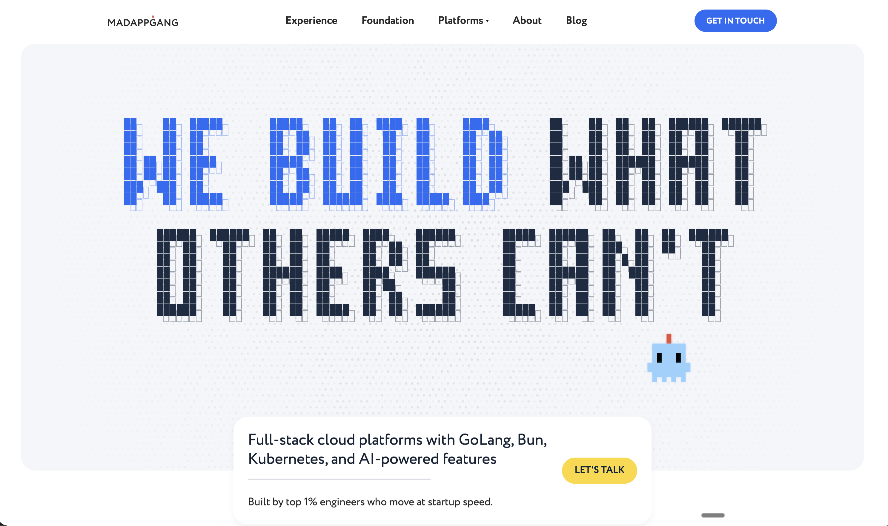

# mnemex-bench

Benchmark and evaluation suite for [mnemex](https://github.com/MadAppGang/mnemex) — a semantic code search and analysis tool for AI coding agents.

This repo contains 11 experiments covering LLM model selection, search pipeline components, tool comparison, and access pattern efficiency. Each experiment is self-contained with its own harness, prompts, raw results, and findings.

## Why this exists

Building a code search tool for AI agents raises questions that can only be answered empirically:

- Which small LLM is best for query expansion on Apple Silicon?
- Does a semantic index actually help agents solve tasks, or is Grep enough?
- Is MCP faster than CLI for tool access? How much does it matter?
- How does mnemex compare to LSP-based tools like Serena?

Each experiment targets one of these questions with reproducible harnesses and raw data.

## Experiments

| # | Experiment | Status | Key Finding |
|---|-----------|--------|-------------|
| 001 | [LLM Speed Benchmark](experiments/001-llm-speed-claudish/) | Complete | Gemini 3 Flash and GPT-5.1 Codex Mini tied at ~33s. GPT best value at $0.25/M tokens. |
| 002 | [Cognitive Memory E2E](experiments/002-cognitive-memory-e2e/) | Null result | 64 sessions, 4 conditions. Sonnet too capable for these tasks — index saves 40% time but not quality. |
| 003 | [MVP Validation](experiments/003-cognitive-mvp-validation/) | Not yet run | Validates observation retrieval from LanceDB. Harness ready. |
| 004 | [Query Expansion Models](experiments/004-query-expansion-models/) | Complete | 25 models benchmarked (16 base + 9 SFT). LFM2-2.6B wins (.816). SFT teaches format, not domain knowledge. |
| 005 | [Query Planner Architecture](experiments/005-query-planner-architecture/) | Complete | No production tool uses LLM query planners. Rule-based classifier is correct (<5ms, ~80% accuracy). |
| 006 | [Code Search Test Harness](experiments/006-code-search-test-harness/) | Design complete | 224-query benchmark spec from SWE-bench + synthetic. 6 ablation conditions, ~$5 total cost. |
| 007 | [Embedding Model Research](experiments/007-embedding-model-research/) | Complete | Small embedding model survey for local code search on Apple Silicon. |
| 008 | [Embedding Eval Methods](experiments/008-embedding-eval-methods/) | Complete | Multi-model validation of eval methodology. 6 external models reviewed and voted on spec. |
| 009 | [Mnemex vs Serena](experiments/009-mnemex-vs-serena/) | Round 1 | Head-to-head MCP comparison: mnemex uses 34% fewer tool calls, Serena ~11% faster wall-clock. |
| 010 | [MCP vs CLI Efficiency](experiments/010-mcp-vs-cli-efficiency/) | Complete | MCP is 14% faster than CLI (47s vs 55s avg) with 33% fewer tool calls. Both 100% pass rate. |
| 011 | [N-Way Code Tool Benchmark](experiments/011-n-way-code-tool-benchmark/) | Round 1 | 3-way comparison: Serena fastest (88s median), bare-claude cheapest on simple tasks, mnemex most thorough. |
| 012 | [SWE-bench Context Ablation](experiments/012-swebench-context-ablation/) | Round 1 | 6-condition ablation on eth-sri/agentbench. mnemex alone best (62.5%), adding CLAUDE.md hurts (38.1%). |

## Key Findings

**Query expansion:** LFM2-2.6B is the best small model for rewriting code queries. Fine-tuning teaches format compliance (0.23 → 0.78 for Qwen3-1.7B) but doesn't add domain knowledge. 3-tier deployment: LFM2-700M (tiny) / Qwen3-1.7B-FT (medium) / LFM2-2.6B (large).

**Tool access patterns:** MCP protocol is 14% faster and uses 33% fewer tool calls than CLI via Bash for the same code investigation tasks. The structured JSON responses reduce parsing overhead for the LLM.

**Tool comparison:** In head-to-head benchmarks, Serena (LSP-based) is fastest for symbol lookup and cross-file tracing. Mnemex (semantic search) uses fewer tool calls but takes longer per call. Bare Claude (Read/Grep/Glob) is competitive on simple lookups but expensive on complex traces.

**Architecture:** No production code search tool uses LLM-based query planners. A rule-based classifier with regex patterns (CamelCase → boost AST, file paths → boost BM25) gives <5ms overhead at ~80% accuracy.

**End-to-end SWE-bench:** mnemex-generated context is the best single source for SWE-bench task solving (62.5% corrected pass rate vs 47.6% baseline). Adding human-written CLAUDE.md on top *hurts* performance (38.1%) — stale static context dilutes fresh task-specific context. Based on a 6-condition ablation of the [eth-sri/agentbench](https://github.com/eth-sri/agentbench) harness.

## Running an experiment

Each experiment contains its own harness scripts and instructions. The general pattern:

```bash
cd experiments/NNN-short-name/
cat README.md              # Read methodology and reproduction steps
./harness/run.sh           # Run the experiment (if applicable)
```

Some experiments require:
- [mnemex](https://github.com/MadAppGang/mnemex) installed and on PATH
- [claudish](https://github.com/MadAppGang/claudish) for LLM speed tests
- Pre-indexed eval repos (see Data Archives below)

## Experiment conventions

Each experiment lives in `experiments/NNN-short-name/` with:

- `README.md` — motivation, methodology, results, findings
- `harness/` — scripts to reproduce the experiment
- `prompts/` — LLM prompts used in the experiment (if applicable)
- `results/` — raw output data
- `research/` or `findings/` — analysis and synthesis (for research experiments)

Experiments are numbered sequentially. Numbers are never reused or renumbered.

## Data archives (S3)

Large binary data (eval repo indexes, model outputs) is stored in S3, not in git.

**Bucket:** `s3://mnemex-bench/` (region: `ap-southeast-2`)

| Archive | Size | Contents |
|---------|------|----------|
| `indexes-20260304-deepseek.tar.gz` | 1.2 GB | 12 eval repos with deepseek-v3.2 enrichment (recommended) |
| `indexes-20260304-deepseek-11of12.tar.gz` | 830 MB | 11 repos enriched (missing 1) |
| `indexes-20260303.tar.gz` | 578 MB | 12 repos, older index version |

**12 eval repos** (~39K symbols, ~1.9GB uncompressed):
ansible/ansible, getzep/graphiti, huggingface/smolagents, huggingface/transformers,
jlowin/fastmcp, openai/openai-agents-python, opshin/opshin, pdm-project/pdm,
qodo-ai/pr-agent, tinygrad/tinygrad, vibrantlabsai/ragas, wagtail/wagtail

```bash
# Download and extract
aws s3 cp s3://mnemex-bench/archives/indexes-20260304-deepseek.tar.gz . --profile tools
tar xzf indexes-20260304-deepseek.tar.gz -C data/
```

## Built by MadAppGang

[](https://madappgang.com)

This research is conducted by [MadAppGang](https://madappgang.com) — an AI engineering company building full-stack cloud platforms with Go, Bun, Kubernetes, and AI-powered features.

Need help with AI tooling, LLM integration, or complex engineering challenges? [Get in touch](https://madappgang.com).

## License

MIT
